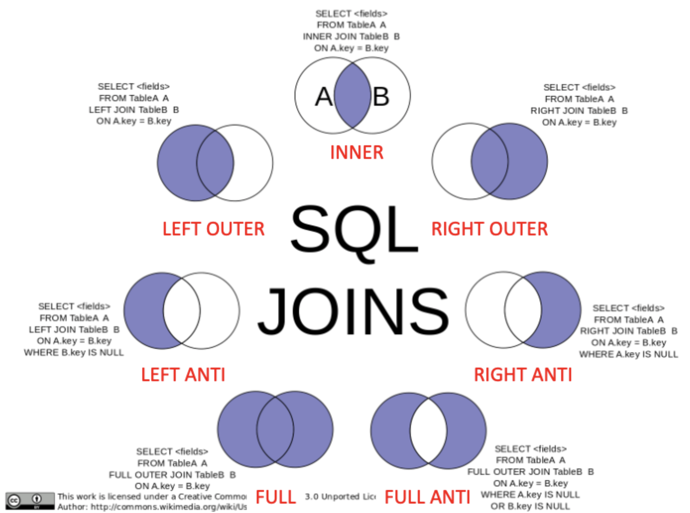
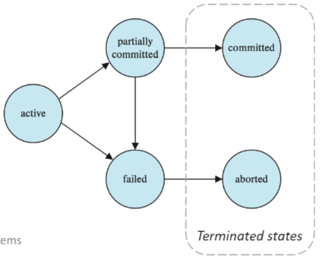
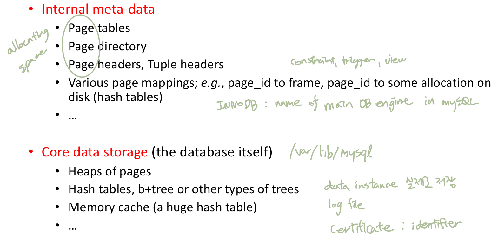
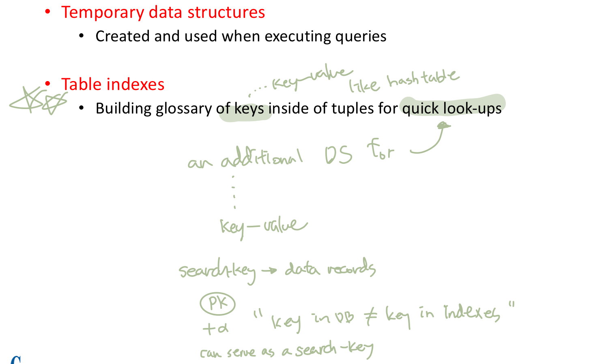
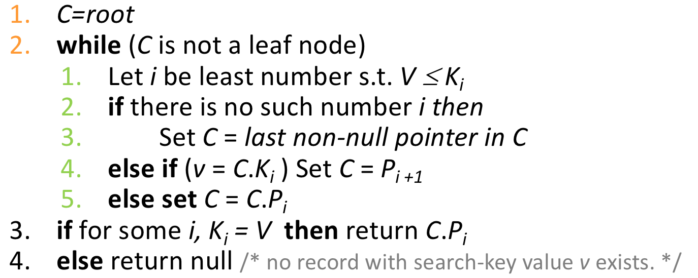

# DB 정리 2

# SQL Queries

## DML

## DDL

## JOIN

: 두 relation을 가지고 새로운 relation을 반환

두 관계에 매치되는 tuple을 필요로 하는 Cartesian product

attributes를 지정함 (project) ???

주로 FROM clause에서 사용됨

### Join conditions

: 두 relation에서 tuple이 어떻게 매치되는지를 정의

1. NATURAL
    
    : 같은 값을 가지는 모든 공통 attributes에 대해 매치
    
    공통 column은 하나만 유지함 (중복 column X)
    
    ON or USING 못씀, 기본으로 INNER JOIN
    
    `FROM <relation1> NATURAL JOIN <relation2>` 
    
    - FROM 이후에 같은 이름의 column이 여러 테이블이 `NATURAL JOIN` 으로 엮일 수 있음
    - caveat
        
        : 이름만 같으면 모든 공통 column에 수행하기 때문에 의도하지 않은 결과가 나올 수 있음
        
        필요한 정보가 생략될 가능성이 있음 → USING()과 함께 사용
        
        어떤 attribute를 사용하는지 알기 어려워 실제 사용은 제한됨
        
2. USING ()
    
    : 어떤 attribute를 이용할 것인지 지정
    
    `FROM <relation1> JOIN <relation2> USING (<attribute_list>)`
    
3. ON <predicate>
    
    : join할 때 predicate를 만족하는 것만 가져옴
    
    언제 ??? 범위 ???
    
    `FROM <relation1> JOIN <relation2> ON <predicate>`
    

`NATURAL JOIN` = `JOIN USING(id)` = `JOIN ON a.id = b.id` 

### Join types

: 매치되지 않는 tuple을 어떻게 다룰 것인지 정의

1. INNER JOIN
    
    : 매치되지 않는 tuple을 유지하지 않음
    
    default join in mySQL (`JOIN` = `INNER JOIN` )
    
2. OUTER JOIN
    
    : 정보 손실을 막기 위해 사용
    
    매치되지 않는 tuple을 NULL을 이용하여 유지
    
    `FROM <relation1> LEFT/RIGHT OUTER JOIN <relation2>` 
    
    OUTER 키워드 생략 가능
    
    1) LEFT OUTER JOIN
    
    : relation1에 있는 tuple만 유지
    
    2) RIGHT OUTER JOIN
    
    : relation2에 있는 tuple만 유지
    
    3) FULL OUTER JOIN
    
    : 모든 tuple을 유지
    
    mySQL 지원 X → `(LEFT OUTER JOIN) UNION (RIGHT OUTER JOIN)` - 순서 중요!
    
3. ANTI
    
    : 상대가 NULL인 것만 → 차집합
    

## Views

: 특정 쿼리를 저장해두고 사용될 때 실행하여 그 결과를 virtual relation으로 이용

conceptual model은 아니지만 사용자에게는 visible한 모든 relation

- 모두가 전체 데이터를 볼 필요는 없음 → 특정 데이터를 숨기고 원하는 데이터만 보여주는 효과
1. Syntax
    
    `CREATE VIEW <view_name>(<attribute_list>) AS <query expression>;`
    
    `DROP VIEW <view_name>;`
    
    한 번 정의되고 나면 virtual relation으로 이용 가능
    
    결과가 저장되는 것이 아니고 (new relation X) 쿼리가 저장되어 실행됨
    
2. View Expansion
    
    : 다른 view로 view를 정의하는 것
    
    query expression에 다른 view의 정의가 포함될 경우 view로 대체
    
3. Materialized View
    
    : pre-calculated result of a query
    
    - view의 종류
        - virtual : not stored in DB
        - materialized : physically stored
    
    즉각적인 반응이 필요할 때 사용, 계속 업데이트 해주어야 함
    
    mySQL X, trigger 사용
    
4. Update via a View
    
    `INSERT INTO <view_name> VALUES(<values>);`
    
    view가 데이터의 인터페이스의 기능을 할 수 있음
    
    simple view에만 허용 (어떻게 업데이트할지 애매하지 않을 때)
    
    - FROM clause에 하나의 relation만 있음
    - SELECT clause에 attribute 이름만 있고 expression, aggregate, distinct 등이 없음
    - SELECT clause에 없는 attribute는 NULL이 가능
    - GROUP BY나 HAVING clause가 없음

## Window functions

: records 사이의 관계를 정의하는 built-in functions

GROUP BY clause와 함께 쓸 수 없음

recored의 수가 줄어들지 않음 (다른 attribute와 함께 볼 수 있음)

`SELECT <WINDOW_FUNCTION> ([ALL] <expression>) OVER ([PARTITION BY <partition_list>] [ORDER BY order_list]) FROM table;` 

### Aggregate window functions

: SUM(), MAX(), MIN(), AVG(), COUNT(), …

`SELECT attritubes, SUM(attribute1) OVER (**ORDER BY** attribute1 **ROWS BETWEEN UNBOUNDED PRECEDING AND UNBOUNDED FOLLOWING**) FROM relation;` 

- 전체 데이터에 대한 attribute1 SUM

`SELECT attritubes, SUM(attribute1) OVER (**PARTITION BY** attribute2) FROM relation;` 

- attribute2로 partitioning하여 해당 파티션의 attribute1의 SUM을 구함

### Ranking window functions

: RANK(), DENSE_RANK(), PERCENT_RANK(), ROW_NUMBER(), NTILE(), …

`SELECT attritubes, RANK() OVER (**PARTITION BY** attribute1 **ORDER BY** attribute2) FROM relation;`

`SELECT attritubes, RANK() OVER <window_name> FROM relation **WINDOW <window_name> AS (PARTITION BY attribute1 ORDER BY attribute2)**;`

- attribute1으로 partitioning하여 해당 파티션의 attribute2 순서대로 ranking
    - ROW_NUMBER : 줄번호,  attribute2 순서대로 증가
    - RANK : attribute2 순서대로 랭킹, tie 있으면 같은 숫자 후 줄 번호로 맞춤
    - DENSE_RANK : attribute2 순서대로 랭킹, tie 있으면 같은 숫자 후 하나 증가

### Value window functions

: LAG(), LEAD(), FIRST_VALUE(), LAST_VALUE(), CUME_DIST(), NTH_VALUE(), …

`SELECT attritubes, FIRST_VALUE(attribute1) OVER (**PARTITION BY** attribute2) FROM relation;` ???

- attribute2으로 partitioning하여 해당 파티션의 attribute1의 첫 번째 값을 보여줌
    - FIRST_VALUE : 첫 번째 값
    - LAST_VALUE : 마지막 값

`SELECT attritubes, LAG(attribute1 , n) OVER (**ORDER BY** attribute2) FROM relation;`

- attribute2 순서대로 나열하고 n만큼 앞에 있는 attribute1의 값을 보여줌
    - LAG : 앞쪽, 위쪽, prev
    - LEAD : 뒤쪽, 아래쪽, next

### Frame Specification

frame : a subset of the current partition

cumulative sum, moving average 등을 구할 때 사용

`ROWS/RANGE BETWEEN <> AND <>`

- ROWS/RANGE
    - ROWS : physical한 포지션 (row)
    - RANGE : logical한 포지션 (value)
- <>
    - UNBOUNDED PRECEDING : first partition row
    - UNBOUNDED FOLLOWING : last partition row
    - CURRENT ROW : 현재 row = 0 FOLLOWING = 0 PRECEDING
    - n PRECEDING : n번째 전의 row(부터)
        - 데이터타입이 시간인 경우 INTERVAL n DAY/HOUR 등이 n에 올 수 있음
    - n FOLLLOWING : n번째 후의 row(까지)

`SELECT attritubes, SUM(attribute1) OVER (**ORDER BY** attribute1 **ROWS BETWEEN UNBOUNDED PRECEDING AND CURRENT ROW**) FROM relation;` 

- 누적 데이터에 대한 attribute1 cumulative SUM

`SELECT attritubes, AVG(attribute1) OVER (PARTITION BY attribute2 ORDER ****BY attribute3 **ROWS BETWEEN 2 PRECEDING AND 0 FOLLOWING**) FROM relation;` 

- 2-record moving average

# Keys

: An attribute or a set of attributes, which helps uniquely identify a tuple (record)

record를 unique하게 구별하게 하는 attribute의 조합

데이터 구별, integrity 보장, 관계 성립을 위해 필요함

- Super key
    
    :  unique identifier
    
    size = attribute의 개수
    
- Candidate key
    
    : minimal subset of super key
    
    size가 가장 작은 슈퍼키
    
- Primary key
    
    : candidate key 중 하나를 선택 (중복 X, NULL X)
    
- Alternate key
    
    : primary key로 선택 받지 못한 candidate key
    
- Foreign key
    
    : 다른 relation의 primary key를 가지고 relation을 정의할 때 사용
    
    data integrity를 유지하는 것을 도움
    
- Composite key
    
    : attribute가 여러 개인 키
    
- Compound key
    
    : foreign key를 가지는 composite key
    
- Surrogate key
    
    : artificial key, 적당한 key가 없을 때 새로 만들어 줌
    

# Transactions

1. 정의
- an indivisible unit of program execution that accesses and updates data items
    - execute entirely or not at all
- a collection of operations that form a **single logical unit of work**
- consists of **a sequence of query**
- atomicity and serialization

→ 많은 유저나 프로세스가 동시에 접근하기 때문에 필요함

1. 방법
    
    1) 시작
    
    : SQL statement가 실행될 때 암시적으로 시작
    
    - explicit - `START TRANSACTION;`
    - implicitly → transaction with the single statement
    
    2) 끝
    
    : 둘 중에 한 상태로 끝나야 함
    
    `COMMIT;` or `ROLLBACK;`
    
    - commit work : complete, permanent updates - done + update storage
    - rollback work : aborting, all updates are undone - canceled + recover
        - 프로그래머가 의도하지 않았더라도 0으로 나누기 같은 failures나 constraint violation에 의해 발생될 수 있음
    
    1. ACID Properties
        - Atomicity : 완전히 실행되거나 아예 실행되지 않아야 함 (all-or-none)
        - Consistency : constraints가 유지되어야 함 (valid data), 데이터 타입 같은거
        - Isolation : 동시에 여러개 가능하지만, 다른 건 없는 것처럼 독립적이어야 함 (cannot be affected by another transaction)
        - Durability : written data는 crash에도 잃지 않아야 함
        
    2. States of a Transaction
        
        
        
        - active : initial state, 실행 되는 중
        - partially committed : 마지막 statement가 실행된 이후
        - failed : 정상적인 진행이 불가할 때
        - committed : 성공적인 완료 이후
        - aborted : transaction이 roll back되고 데이터베이스가 회복된 이후
        - terminated : committed or aborted
        
    3. Serializable Behaviors
        
        : 각각의 operation은 정확하게 실행되었어도 겹쳐서 실행하면 전체 결과는 정확하지 않을 수 있음
        
        특정 operation은 serializable(one at a time, with no overlap)한 것처럼 실행되어야 해야 함 → 실제로는 parallel
        
    4. Levels of Transactions
        
        : 여러 transaction의 parallelism → throughput 증가를 위함
        
        - Read-Only Transactions
            
            `SET TRANSACTION READ ONLY`
            
            : transaction 동안 쓰지 않고 읽기만 함 (select O, insert, update, delete X)
            
            parallelism이 증가함
            
            ↔ update transactions
            
        - Possible Issues
            - Phantom read
                
                : 한 transaction 안에서 같은 SELECT 쿼리가 **새로운 committed INSERT 쿼리 때문에** 다른 결과를 갖는 것
                
            - Non-repeatable read
                
                : 한 transaction 안에서 같은 SELECT 쿼리가 **새로운 committed UPDATE/DELETE 쿼리 때문에** 다른 결과를 갖는 것
                
            - Dirty read
                
                : **UNCOMMITTED transaction** 때문에 다른 데이터를 읽는 것
                
        - Isolation Levels of Transactions
            
            : `SET TRANSACTION ISOLATION LEVEL <LEVEL>`
            
            locking data의 레벨 선언
            
            concurrency와 data integrity 사이의 tradeoff; 레벨 높을수록 integrity 높음
            
            1) SERIALIZABLE (Level 3)
            
            : 하나씩 실행되는 것처럼 행동
            
            SELECT가 수행되는 모든 데이터에 lock
            
            2) REPEATABLE READ (Level 2)
            
            : 같은 쿼리는 결과가 동일
            
            **그 전에 (낮은 transaction #에서) commit된/다른 transaction에서 insert된 데이터**만 읽을 수 있음
            
            SELECT가 수행되는 모든 데이터에 lock (insert O, update, delete X)
            
            3) READ COMMITTED (Level 1)
            
            : 같은 쿼리는 결과가 동일
            
            committed 데이터만 읽을 수 있음
            
            → 다른 transaction에 의해 commit된 수정도 읽을 수 있음
            
            SELECT가 수행되는 동안만 데이터에 lock (update, delete O)
            
            4) READ UNCOMMITTED (Level 0)
            
            : 아직 commit되지 않은 데이터도 조회 가능
            
            속도는 빠름
            
            SELECT가 수행되는 동안 lock 없음 (사실상 no isolation, no data integrity)
            
            | Isolation level | Phantom read | Non-repeatable read | Dirty read |
            | --- | --- | --- | --- |
            | SERIALIZABLE | X | X | X |
            | REPEATABLE READ | O | X | X |
            | READ COMMITTED | O | O | X |
            | READ UNCOMMITTED | O | O | O |

# Basic Programming Structures

## Constraints

: DB를 corruption에서 보호하는 방법

- Data constraint : data type, not null, check()
- Key constraint : unique, …
- Referential integrity constraint : Foreign key

## Database catalog

: database object의 정의가 저장된 **메타데이터(data about data)**로 구성된 database instance

base tables(schema), views, synonyms, value ranges, indexes, users and user groups

- operation에 statement 여러 개면 delemiter 바꿔주어야 함
    
    : `**DELEMITER &&** CREATE FUNCTION <...> END && **DELIMITER ;**`
    
- Flow Control Statement 이용 가능
    - IF
        
        `IF <condition> THEN <statements> ELSEIF <condition> THEN <statements> ELSE <statements> ENDIF`
        
    - CASE
        
        `CASE <expression> WHEN <value> THEN <statements> ... ELSE <statements> END CASE`
        
        `CASE WHEN <condition> THEN <statements> ... ELSE <statements> END CASE`
        
    - LOOP
        
        `[label:] LOOP <statements> END LOOP [label]`
        
        `[label:] REPEAT <statements> UNTIL <condition> END REPEAT [label]`
        
        `[label:] WHILE <condition> DO <statements> END WHILE [label]`
        
        - `ITERATE <label>` : continue
        - `LEAVE <label>` : break

## Stored Procedures = Procedures

: pre-compiled code, 나중에 호출되어 사용되도록 저장된 SQL commands (DML, DDL)

procedure 안에서 다른 procedure 호출 가능

직접적인 리턴은 없지만 **간접적으로** scalars or results set을 반환

`CREATE PROCEDURE <name> (<param_spec>) BEGIN <operation> END`

- param_spec
    
    : `IN/OUT/INOUT <param_name> <param_type>`
    
    input / output args 설정 → **INTO** output_args → output args에 리턴값이 저장됨
    

 `CALL <name>(<param>)`

- output param에 session variable(@s) 이용 → 결과 조회 : select @s

`SHOW PROCEDURE STATUS;`

: 만들어진 procedure 리스트 보여줌

`DROP PROCEDURE;`

## Functions

: built-in function처럼 사용되는 user-defined routines

argument 받아 직접적으로 single value/table 리턴

`CREATE FUNCTION <name> (<param_spec>) RETURNS <return_type> [(NOT) DETERMINISTIC] BEGIN <statements> END`

- param_spec
    
    : `<param_name> <param_type>`
    
- 바뀌는 부분이 없으면 `DETERMINISTIC` → cache
- statement가 하나면 BEGIN, END 생략 가능
- operation
    
    `DECLARE <name> <type>;` - local variable 선언
    
    `INTO <return_variable> ... RETURN <return_variable>;` 
    
    Table function : `RETURNS TABLE (<schemas>) RETURN TABLE (statement)`
    
    → `SELECT * FROM **TABLE(function(param))**;` 으로 조회
    

`SHOW FUNCTION STATUS;`

## Triggers

: 하나의 이벤트(DB 수정)가 발생했을 때 자동으로 DB operation이 수행됨 (corrective action)

**Event-Condition-Action rule (ECA rule)**

`[DEFINER = {user | CURRENT_USER}] CREATE TRIGGER <name> <trigger_time> <trigger_event> ON <table_name> FOR EACH ROW [FOLLOWS/PRECEDES] <trigger_action>`

- Event 지정
    - trigger_time
        
        : `BEFORE/AFTER`
        
    - trigger_event
        
        : `INSERT/DELETE/UPDATE`
        
    - 특정 attributes 지정
        
        : `<trigger_time> <trigger_event> OF <attribute> ON <table>`
        
    - 수정 전/후 값 reference
        
        `REFERENCING OLD ROW` : update, delete
        
        `REFERENCING NEW ROW` : update, insert
        
- Condition 지정
    
    `WHEN <condition>`
    
- Action 지정
    
    `BEGIN (ATOMIC) <action> END` : atomicity
    

- Statement Level trigger
    - `FOR EACH STATEMENT`
        
        : statement로 영향을 받은 모든 row
        
        더 효율적일 수 있음
        
    - `REFERENCING OLD/NEW TABLE`
        
        : trainsition tables 참조
        

`SELECT * FROM information_schema.triggers`

: mySQL에서 DB형태로 제공 (built-in)

`SHOW TRIGGERS`

: mySQL O, SQL standard X

- When not to use triggers
    - 초기에는 summary data, replicating db 등의 이유로 사용함
        
        → materialized view, built-in replication 제공
        
    - 의도하지 않은 실행, cascading execution 등의 위험성
        
        → 요즘은 잘 사용하지 않음
        

# Indexes

- Data structures in DB Internals
    
    : Internal meta-data, Core data storage, Temporary data structure, Table indexes 등의 목적
    
    
    
    
    

## Database indexes

- Indexing
    
    : 원하는 데이터에 빠르게 접근하기 위한 메커니즘
    
    추가적인 공간과 쓰는 cost를 들여 데이터를 복제함
    
    sequential search → binary search
    
    specified value/range 검색 → access time, insertion/deletion time, space overhead 고려
    
- Table indexes
    
    search-key + pointer
    
    ordered index / hash index
    
    multiple index 가질 수 있음 → DBMS가 best index 찾음
    
    synchronization 해주어야 함
    

## Ordered index

### Indexed-Sequential Files

search-key 값으로 sorting

composite search-key는 lexicographically sorted

- dense index : 모든 search-key 값이 파일에 나타남
- sparse index : 몇 개의 search-key 값만 포함
- clustering index : primary index, search-key가 파일 순서를 지정
- non-clustering index : secondary index, 파일과 인덱스의 search-key 순서가 다름
    
    ⇒ sparse → clustering
    
    ⇒ non-clustering → dense
    

### B+tree Index Files

- B+tree
    
    : a **self-balancing** tree that keeps data sorted and allows searches
    
    M-way search tree (generalized BST)
    
    perfectly balaned; root to leaf always log n → O(log n)
    
    K search-key values → tree height = maximum ceiling(log ceiling(n/2) (k))
    
    every inner node is at least half-full
    
- B+tree nodes
    
    : max M-1 elements and M child
    
    - root
        
        : at least 2 children(pointer)
        
    - Non-leaf nodes
        
        : ceiling(M/2) and M children(pointer)
        
        element보다 pointer가 하나 더 많음
        
        P(i)가 가리키는 value는 K(i-1)보다 크거나 같고 K(i)보다 작아야 함
        
        guiding to the leaf node with search target
        
    - leaf node
        
        : ceiling(M-1/2) and M-1 values(element)
        
        P(i)는 파일 레코드 포인터, K(i)는 search-key value
        
        search-keys are sorted, P(M) points to next leaf node
        
        sequential search / random search 모두 가능
        
    - In commercial
        - pointer : PostgreSQL, DB2, SQL Server, Oracle
        - tuple data : mySQL, SQLite, SQL Server, Oracle
- Queries on B+trees
    - function find(v)
        
        
        
- B+tree operations
    - Insertion
        - Enough space → put
        - Leaf Full
            
            : key의 반은 남고 나머지 반은 새로운 노드를 만듦
            
            새로운 노드의 첫 element를 parent로 **copy**
            
            - Parent Full
                
                : parent도 나누고 new node의 첫 노드를 parent의 parent로 옮기고 (**move**) new node의 첫 노드를 copy
                
        
        ⇒ 첫 노드를 제외한 leaf 노드의 첫 원소는 위에 모두 나타나야 함
        
    - Deletion
        
        : merge 이용
        

## Inverted index

: word에서 그 단어를 포함하는 records로의 mapping을 저장

full-text search index, concordance in old contexts

info → id로 search가 쉽도록, full text search 안해도 되도록 각 단어가 나타난 인덱스 리스트를 저장

두 단어로 search하면 merge하여 중복 없이 나타낼 수 있음