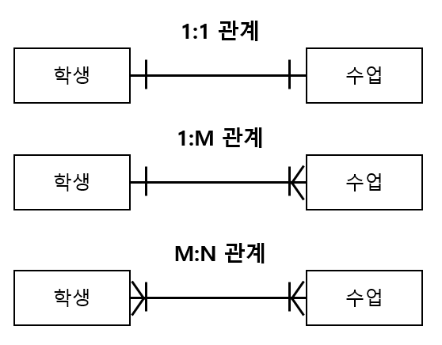

# SQLD

# 데이터 모델링의 이해

## 데이터 모델링의 이해

### 데이터모델의 이해

- 데이터 모델링
    - 현실세계를 DB로 표현하기 위해 **추상화**
    - 고객과의 의사소통을 통해 고객의 업무 프로세스를 이해해야 함
    - 고객이 쉽게 이해할 수 있도록 간단하게
    - 고객의 비즈니스 프로세스를 이해 한 후에 규칙을 추상화하고, 정의된 규칙을 데이터 모델로 표현
    - 업무 프로세스는 추상화하고 SW 분석/설계 과정에서 더 상세해짐
- 데이터 모델링의 특징
    - 추상화 (abstraction) : 공통적인 특징을 찾아 현실세계를 간략하게 표현해야 함
    - 단순화 (simplification) : 누구나 쉽게 이해할 수 있어야 함
    - 명확성 (clarity) : 명확하게 의미가 해석되어야 하고 한 가지 의미를 가져야 함
- 데이터 모델링 단계
    1. 개념적 모델링 (Conceptual Data Modeling)
        - 고객의 비즈니스 프로세스를 분석하고 전체에 대해 데이터 모델링을 수행
        - 중요한 부분을 위주로 복잡하지 않게 표현
        - 업무적 관점에서 모델링하며 기술적 용어는 가급적 피함
        - Entity와 Attribute를 도출하고 ERD(Entity Relationship Diagram)을 작성
    2. 논리적 모델링 (Logical Data Modeling)
        - 개념적 모델링을 변환
        - 식별자 (identifier)를 도출하고 필요한 모든 relation을 정의
        - 정규화를 수행하여 데이터 모델의 독립성을 확보
    3. 물리적 모델링 (Physical Modeling)
        - 데이터베이스를 실제로 구축
        - 테이블, 인덱스, 함수 등을 생성
        - 성능, 보안, 가용성을 고려해야 함
- 데이터 모델링 관점
    - 데이터
        
        : 비즈니스 프로세스에서 사용되는 데이터
        
        구조 분석, 정적 분석
        
    - 프로세스
        
        : 비즈니스 프로세스에서 사용되는 작업
        
        시나리오 분석, 도메인 분석, 동적 분석
        
    - 데이터와 프로세스
        
        : 프로세스와 데이터 간의 관계
        
        CRUD 분석
        
- 데이터 모델링을 위한 ERD (Entity Relationship Diagram)
    
    : entity와 entity 간의 관계를 정의
    
    - 작성 절차
        1. entity를 도출하고 그림
            
            : 관리해야 하는 집합을 도출
            
        2. entity를 배치
            
            : 중요한 entity를 왼쪽 상단에 배치
            
        3. entity 간의 관계를 설정
        4. 관계명을 서술
            
            : entity 간의 행동을 표현
            
        5. 관계 참여도를 표현
            
            : 각 entity가 참여하는 관계 수 (ex. one-to-one, many-to-many, …)
            
        6. 관계의 필수 여부를 표현
            
            : 최소 참여 수가 1인지 아닌지
            
- 데이터 모델링 고려사항
    1. 데이터 모델의 독립성
        - 변화에 능동적 대응 가능
        - 중복된 데이터를 제거하는 것이 필요 → 정규화
    2. 고객 요구사항의 표현
    3. 데이터 품질 확보
        - 데이터 표준을 정의해야 함

### 3층 스키마 (3-Level Schema)

: 사용자, 설계자, 개발자가 데이터베이스를 보는 관점에 따라 데이터베이스를 기술하고 관계를 정의한 ANSI 표준 (ANSI : American National Standards Institute로, DB 관련된 표준을 정의함)

| 외부 단계
(External Level) | 외부 스키마1, …, 외부 스키마n | 사용자 관점
업무상의 데이터 접근
관련 DB의 view를 표시
앱이 접근하는 DB를 정의 |
| --- | --- | --- |
| 개념 단계
(Conceptual Level) | 개념 스키마 | 설계자 관점
사용자 전체의 DB
전체 DB의 규칙와 구조를 표현
통합 DB 구조 |
| 내부 단계
(Internal Level) | 내부 스키마 | 개발자 관점
DB의 물리적 저장 구조
데이터 저장 구조, 레코드 구조, 필드 정의, 인덱스, … |
- 3층 스키마는 DB의 독립성을 확보하기 위한 방법
    
    → 데이터 복잡도 감소, 데이터 중복 제거, 사용자 요구사항 변경에 따른 대응력 향상, 관리 및 유지보수 비용 절감 등의 효과
    
    - 독립성의 종류 (아래에서 위로 영향 X)
        - 논리적 독립성 : 개념 스키마가 변경되더라도 외부 스키마에 영향 X
        - 물리적 독립성 : 내부 스키마가 변경되더라도 개념 스키마에 영향 X
- 각 계층을 view라고 함

### 엔터티

- 엔터티 (Entity)
    
    : 업무에서 관리해야 하는 데이터셋
    
    저장되고 관리되어야 함 → 업무 상에서 관리되어야 하는 정보를 추출하여 엔터티를 만듦
    
    개념, 사건, 장소 등의 명사를 이름으로 가짐
    
    변별할 수 있는 사물 → DB 내에서 변별할 수 있는 객체
    
- 엔터티 특징
    
    
    | 식별자 (identifier) | 유일한 식별자가 있어야 함 |
    | --- | --- |
    | 인스턴스 집합 | 2개 이상의 인스턴스가 있어야 함 |
    | 속성 (attribute) | 속성을 반드시 가짐 |
    | 관계 (relation) | 다른 엔터티와 한 개 이상의 관계를 가져야 함 |
- 엔터티 종류 ⭐
    - 유형과 무형에 따른 엔터티 종류
        
        
        | 유형 엔터티 | 업무에서 도출되어 지속적으로 사용되는 엔터티
        ex. 고객, 강사, 사원, 학생, 교사 |
        | --- | --- |
        | 개념 엔터티 | 물리적 형태가 없음
        ex. 보험상품 |
        | 사건 엔터티 | 비즈니스 프로세스를 실행하면서 생성되는 엔터티
        ex. 주문, 수강, 체결 |
    - 발생 시점에 따른 엔터티 종류
        
        
        | 기본 (Basic) 엔터티  | = 키 엔터티
        다른 엔터티로부터 영향 없이 독립적으로 생성됨
        ex. 고객, 상품 |
        | --- | --- |
        | 중심 (Main) 엔터티 | 기본 엔터티로부터 발생되어 행위 엔터티를 생성함
        ex. 주문 |
        | 행위 (Active) 엔터티 | 2개 이상의 엔터티로부터 발생함
        ex. 주문 이력 |
- 표기법 !!!

### 속성

- 속성 (Attribute)
    
    : 엔터티가 가지는 항목
    
    의미적으로 더이상 분리되지 않는 단위
    
    인스턴스의 구성요소
    
- 속성의 특징과 종류
    - 특징
        
        : 업무에서 관리되는 정보
        
        **하나의 값만 가짐**
        
        주 식별자에게 함수적으로 종속됨 → 기본키가 변경되면 속성의 값도 변경
        
    - 속성의 종류
        - 분해 여부에 따라
            
            
            | 단일 속성 | 하나의 의미로 구성 |
            | --- | --- |
            | 복합 속성 | 여러 개의 의미로 분해 가능
            ex. 주소 (시, 동, ..) |
            | 다중값 속성 | 여러 개의 값을 가질 수 있음
            엔터티로 분해됨
            ex. 상품 리스트 |
        - 특성에 따라
            
            
            | 기본 속성 | 비즈니스 프로세스에서 도출되는 본래의 속성
            ex. ID, 이름 |
            | --- | --- |
            | 설계 속성 | 데이터 모델링 과정에서 발생되는 속성
            유일한 값을 부여
            ex. 상품코드, 지점 코드 |
            | 파생 속성 | 다른 속성에 의해 만들어지는 속성
            ex. 합계, 평균 |

### 관계

- 관계 (Relationship)
    
    : 엔터티 간의 관련성을 의미
    
- 관계의 종류
    - 존재 관계
        
        : 두 개의 엔터티가 존재 여부의 관계가 있음
        
        **엔터티 간의 상태**를 의미
        
        ex. 학생이 입학을 하면 지도교수님이 배정됨 (관계가 있음)
        
    - 행위 관계
        
        : 두 개의 엔터티가 어떤 행위에 의한 관련성이 있음
        
        ex. 학생이 특정한 수업을 수강함 (수강이라는 행위가 있음)
        
- 관계 차수 (Cardinality)
    
    : 두 개의 엔터티 간에 관계에 참여하는 수
    
    
    
    
    
    - 종류
        - 1대1 관계
            - 완전 1대1 관계 : 하나의 엔터티에 관계되는 엔터티가 반드시 하나임
            - 선택적 1대1 관계 : 하나의 엔터티에 관계되는 엔터티가 하나이거나 없음
        - 1대N 관계 : 하나의 엔터티에 다른 엔터티의 값이 여러 개임
        - M대N 관계 : 두 개의 엔터티가 서로 여러 개를 가짐
            
            관계형 데이터베이스에서 해당 관계의 조인은 1:N, N:1로 해소해야 함
            
        - 필수적 관계 : 반드시 하나는 존재해야 함, |
        - 선택적 관계 : 없을 수도 있음, O
- 식별 관계와 비식별 관계
    - 식별 관계 (Identification Relationship)
        
        : 부모테이블의 기본키(PK)가 자식 테이블의 외래키이자 기본키로 사용되는 관계
        
        실선으로 표현
        
        - 강한 개체 (String Entity)
            
            : 다른 엔터티에 의존하지 않고 독립적으로 존재
            
            다른 엔터티와 관계를 가질 때 기본키를 공유함
            
            강한 개체의 기본키가 변경되면 식별 관계에 있는 엔터티(약한 개체)의 값도 변경됨
            
    - 비식별 관계 (Non-Identification Relationship)
        
        : 강한 개체의 기본키를 다른 엔터티의 일반 칼럼으로 관계를 가짐
        
        점선으로 표현
        
        - 약한 개체 (Weak Entity)
            
            : 개체의 존재가 다른 개체의 존재에 달려 있음
            

### 식별자

- 키와 식별자의 차이
    
    : 식별자는 업무적으로 구분이 되는 정보로 논리적 데이터 모델링 단계에서 사용하고, 키는 테이블에 접근하기 위한 매개체로 물리적 데이터 모델링 단계에서 사용함
    
- 주식별자 (기본키, Primary key)
    - 성질
        - 최소성 : 속성수가 최소여야 함
        - 대표성 : 엔터티를 대표할 수 있어야 함
        - 유일성 : 엔터티의 인스턴스를 유일하게 식별함
        - 불변성 : 자주 변경되면 안됨
- 키의 종류
    - 유일성 : 한 행을 구별하게 함
    - 최소성 : 최소한의 속성으로 이루어져 있음
    
    | 기본키 | Primary key | 후보키 중에 엔터티를 대표할 수 있는 키 |
    | --- | --- | --- |
    | 후보키 | Candidate key | 유일성과 최소성을 만족하는 키 |
    | 슈퍼키 | Super key | 유일성은 만족하지만 최소성을 만족하지 않는 키 |
    | 대체키 | Alternate key | 후보키 중 기본키가 아닌 키 |
    | 외래키 | Foreign key | 다른 키의 기본키로 참조 무결성 (Referential Integrity)을 확인하기 위해 사용
    허용된 데이터 값만 저장하기 위해 사용 |
- 식별자의 종류
    - 대표성에 따라
        - 주식별자 : 유일성, 최소성, 대표성을 만족, 다른 엔터티와 참조 관계로 연결될 수 있음
        - 보조 식별자 : 유일성과 최소성은 만족하지만 대표성을 만족하지 못하는 식별자
    - 생성 여부
        - 내부 식별자 : 엔터티 내부에서 스스로 생성되는 식별자
        - 외부 식별자 : 다른 엔터티와의 관계로 인해 만들어지는 식별자
    - 속성의 수
        - 단일 식별자 : 하나의 속성으로 구성
        - 복합 식별자 : 여러 개의 속성으로 구성
    - 대체 여부
        - 본질 식별자 : 비즈니스 프로세스에서 만들어지는 식별자
        - 인조 식별자 : 인위적으로 만들어지는 식별자

## 데이터 모델과 성능

### 정규화 (Normalization)

- 정규화
    - **데이터의 일관성, 최소한의 데이터 중복, 최대한의 데이터 유연성**을 위해 데이터를 분해하는 과정
    - 불필요한 데이터의 입력을 줄임으로써 데이터 중복을 제거하여 데이터 모델의 독립성을 확보함
    - 비즈니스에 변화가 있지만, 데이터 모델의 변경을 최소화할 수 있음
    - 제1정규화부터 제5정규화까지 있지만 실질적으로는 제3정규화까지만 수행함
    
    | 제1정규화 | Attribute의 원자성 확보
    Primary key 설정 |
    | --- | --- |
    | 제2정규화 | 기본키가 2개 이상의 속성인 경우 부분 함수 종속성을 분해함 |
    | 제3정규화 | 기본키를 제외한 칼럼 간 종속성(이행 함수 종속성)을 제거 |
    | BCNF | 후보키가 기본키를 종속시키면 분해함 |
    | 제4정규화 | 여러 칼럼이 하나의 칼럼을 종속시키는 경우 분해함 (다중값 종속성 제거) |
    | 제5정규화 | 조인에 의해서 종속성이 발생되는 경우 분해함 |
- 함수적 종속성 (Functional Dependency)
    
    : X→Y이면 Y는 X에 함수적으로 종속됨 (X의 변화에 따른 Y의 변화를 확인)
    
    1. 제1정규화
        
        : 테이블의 칼럼이 원자값을 갖도록 테이블을 분해 + 기본키 설정
        
    2. 제2정규화
        
        : 기본키가 2개 이상인 경우에, 기본키의 부분집합이 결정자가 되지 않도록 함 
        == 완전 함수 종속 만족 
        == 부분 함수 종속성 제거 (No partial dependency)
        
    3. 제3정규화
        
        : 기본키를 제외한 칼럼 간에 종속성을 제거
        == 이행 함수 종속성을 제거 (No transitive dependency)
        
    4. BCNF (Boyce-Codd Normal Form)
        
        : 제3정규화을 강화한 일종의 제3정규화의 부분집합
        
        모든 결정자가 후보키(유일성, 최소성 만족) 집합에 속해야 함
        
        기본키를 선정한 후에도 후보키가 존재하여 기본키의 속성 중 하나를 함수적으로 종속함
        
    5. 제4정규화
        
        : multi-valued dependency를 제거
        
    6. 제5정규화
        
        : Join dependency를 제거
        

### 정규화와 성능

- 정규화는 데이터 중복을 제거하여 모델의 유연성을 높이지만,
- 데이터 조회 시 조인을 유발하기 때문에 CPU와 메모리를 많이 사용함 → 반정규화
    - 조인은 중첩된 루프를 사용함
- 반대로 반정규화는 데이터를 중복시켜 블록의 크기가 넘어가게 되면 디스크 입출력이 증가하여 성능이 떨어지게 됨 → 정규화

### 반정규화 (De-Normalization)

: 데이터베이스의 성능 향상을 위하여 데이터 중복을 허용하고 조인을 감소시킴

SELECT 쿼리 실행 속도는 빨라지지만 데이터 모델의 유연성은 낮아짐

- 수행하는 경우
    - 정규화로 인해 수행 속도가 느려지는 경우
    - 다량의 범위를 자주 처리해야 하는 경우
    - 특정 범위의 데이터만 자주 처리하는 경우
    - 요약/집계 정보가 자주 요구되는 경우
- 반정규화 절차
    
    
    | 대상 조사 및 검토 | 데이터 처리 범위, 통계성 등을 확인하여 대상을 조사함 |
    | --- | --- |
    | 다른 방법 검토 | 클러스터링, 뷰, 인덱스 튜닝, 파티션, 응용 프로그램 등의 방법을 검토함 |
    | 반정규화 수행 | 테이블, 속성, 관계 등을 반정규화함 |
- 반정규화 기법
    - 계산된 칼럼 추가
        
        : 특정 칼럼에 필요한 결과를 미리 계산하여 저장함
        
    - 테이블 분할 (=? 파티션 기법)
        - 테이블 수직분할
            
            : 하나의 테이블을 두 개 이상의 테이블로 분할 (칼럼을 분할)
            
        - 테이블 수평분할
            
            : 값을 기준으로 테이블을 분할 (값의 특정 범위로 분할)
            
        - 분할 기준
            - Range Partition : 데이터 값의 범위를 기준으로
            - List Partition : 특정한 값을 지정하여
            - Hash Partition : 해시 함수를 적용하여
            - Composite Partition : 범위와 해시를 복합적으로 사용하여
        
        ⇒ 접근 범위가 감소 / IO 성능이 향상됨 / 독립적인 백업 및 복구가 가능함
        
    - 테이블 병합
        - 1대1 관계의 테이블을 하나로 병합
        - 1대N 관계의 테이블을 병합
        - 슈퍼 타입과 서브 타입 관계의 테이블을 통합 (부모-자식 관계)
            - 슈퍼 타입 및 서브 타입 변환 방법
                
                
                | OneToOne Type | 슈퍼 타입과 서브 타입을 개별 테이블로 도출
                테이블 수가 많아서 조인이 많고 관리가 어려움 |
                | --- | --- |
                | Plus Type | 슈퍼 타입과 서브 타입 테이블로 도출
                조인이 발생하고 관리가 어려움 |
                | Single Type | 하나의 테이블로 도출
                조인이 좋고 관리가 편하지만 IO 성능이 나쁨 |
        
        ⇒ 처리량 증가 / 검색 이외의 기능 복잡해짐 / 제약조건 설계 어려움
        

### 분산 데이터베이스


- 분산 데이터베이스
    - 중앙 집중형 데이터베이스
        
        : 하나의 물리적 시스템에 DB 관리 시스템을 설치하고 여러 사용자가 접속하여 이용하는 구조
        
    - 분산 데이터베이스
        
        : 물리적으로 떨어진 DB에 네트워크로 연결하여 단일 데이터베이스 이미지를 보여주고 분산된 작업 처리를 수행하는 데이터베이스
        
        - 사용자는 분산 여부를 인식하지 못함 → 투명성 제공
    - 투명성의 종류
        
        
        | 분할 투명성 | 고객은 하나의 논리적 관계가 여러 단편으로 분할되어 그 사본이 여러 시스템에 저장되어 있음을 인식할 필요가 없음 |
        | --- | --- |
        | 위치 투명성 | 사용하려는 데이터의 저장 장소를 명시할 필요가 없음
        데이터가 어디 있더라도 동일한 명령을 통해 접근할 수 있어야 함 |
        | 지역 사상 투명성 | 각 지역 시스템 이름과 무관한 이름이 사용 가능함 (mapping 보장) |
        | 중복 투명성 | 데이터베이스 객체가 여러 시스템에 중복되어도 일관성이 유지되어야 함 |
        | 장애 투명성 | 각 지역의 시스템이나 통신망에 이상이 발생해도 무결성이 보장되어야 함 |
        | 병행 투명성 | 여러 고객이 동시에 트랜잭션을 수행하는 경우에도 이상이 없음 |
- 분산 데이터베이스 설계 방식
    - 상향식 설계 방식
        
        : 지역 스키마 작성 후 전역 스키마를 작성
        
        → 지역 별로 DB 구축 후 통합
        
    - 하향식 설계 방식
        
        : 전역 스키마 작성 후 지역 사상 스키마를 작성
        
        → 기업 전체의 전사 데이터 모델을 수렴하여 전역 스키마를 생성한 후 지역 스키마를 생성
        
    - 여러 종류의 DBMS를 사용한다면 미들웨어 (ODBC, JDBC)를 사용해야 함
- 분산 데이터베이스 장단점
    - 장점
        - 신뢰성과 가용성이 높음
        - 빠른 응답이 가능 (병렬 처리를 함)
        - 시스템 용량 확장이 쉬움
    - 단점
        - 관리와 통제가 어려움 (분리되어 있어서)
        - 보안 관리가 어려움
        - 데이터 무결성 관리가 어려움
            - 데이터 무결성 : 정확성, 일관성, 유효성을 지키는 것
        - 설계가 복잡함

# SQL 기본 및 활용

## SQL 기본

### 관계형 데이터베이스 (Relation Database)

- 관계형 데이터베이스
    - 관계형 데이터베이스의 등장
        - 릴레이션 간의 조인을 통해 집합 만듦
    - DB vs. DBMS
        - DB는 자료구조에 따라 나뉨
            - 계층형 : 트리 이용, 1대N 관계
            - 네트워크형 : 오너와 멤버 형태, 1대N + M대N 표현
            - 관계형 : 릴레이션 이용
                - 집합 연산 : 합집합, 차집합, 교집합, 곱집합
                - 관계 연산 : 선택, 투영, 결합, 나누기
        - DBMS는 DB를 관리하기 위한 소프트웨어
- 테이블의 구조
    - 기본키 : 테이블에서 유일성, 최소성, Not null, 대표성을 만족
    - 행 : 하나의 테이블에 저장되는 값, 튜플
    - 칼럼 : 데이터를 저장하기 위한 필드, 속성
    - 외래키 : 다른 테이블의 기본키를 참조, 조인에 이용

### SQL (Structured Query Language) 종류

: 관계형 데이터베이스에서 데이터의 구조를 정의, 데이터 조작, 데이터 제어 등을 수행하는 절차형 언어

- SQL 종류
    
    
    | | |
    | --- | --- |
    | DDL (Data Definition Language) | DB 구조를 정의 → CREATE, ALTER, DROP, RENAME |
    | DML (Data Manipulation Language) | 테이블에서 데이터를 입력, 수정, 삭제, 조회 → INSERT, UPDATE, DELETE, SELECT |
    | DCL (Data Control Language) | DB 사용자에게 권한을 부여하거나 회수 → GRANT, REVOKE, TRUMCATE |
    | TCL (Transaction Control Language) | 트랜잭션을 제어 → COMMIT, ROLLBACK, SAVEPOINT |
    - 작업의 순서 : 사용자에게 권한을 부여 (DCL) → 사용자가 DB 구조 정의 (DDL) → 데이터 입력 및 작업 (DML, TCL)
- 트랜잭션 (Transaction)
    
    
    | | |
    | --- | --- |
    | 원자성 (Atomicity) | 전부 실행되거나 전혀 실행되지 않아야 함<br>All or Nothing |
    | 일관성 (Consistency) | 트랜잭션 실행 결과로 상태가 모순되지 않아야 함 |
    | 고립성 (Isolation) | 중간 결과를 다른 트랜잭션이 접근할 수 없음 |
    | 영속성 (Durability) | 실행이 성공적으로 완료되었으면 결과가 영구적으로 보장되어야 함 |
- SQL문의 실행 순서
    1. 파싱 (Parsing)
        
        : SQL문의 문법을 확인하고 구문분석
        Library Cache에 저장
        
    2. 실행 (Execution)
        
        : 옵티마이저의 계획에 따라 SQL을 실행
        
    3. 인출 (Fetch)
        
        : 데이터를 읽어서 전공
        

### DDL (Data Definition Language)

- 테이블 생성
    
    ```sql
    CREATE TABLE <table_name> (
    	<column_name1> <datatype> **primary key**,
    	<column_name2> <datatype> default 0,
    	<column_name1> <datatype>
    );
    ```
    
    - 데이터타입(char/byte)
        
        : number(), varchar2(), char(), date(), …
        
        - 자리수에 (10, 2) → 소수점 둘째 자리까지
    - 기본키
        
        : primary key
        
    - 제약조건
        - default : 기본값 설정 ex. sysdate == 오늘의 날짜
        - not null
        - constraint
            - 기본키 설정 : constraint <name> primary key(columns)
            - 외래키 설정 : constraint <name> foreign key(column) references <ref_table>(column)
                - **on delete cascade**
                    
                    : 참조하던 테이블의 데이터가 삭제되면 자동으로 자신도 삭제됨
                    
                    → 참조 무결성 준수
                    
- 테이블 변경
    - 테이블 이름 변경
        
        ```sql
        ALTER TABLE <*old_name*> RENAME TO <*new_name*>;
        ```
        
    - 칼럼 추가
        
        ```sql
        ALTER TABLE <*name*> 
        	ADD (<*column_name*> <*datatype*> <*constraint*>);
        ```
        
    - 칼럼 변경
        
        ```sql
        ALTER TABLE <*name*> 
        	MODIFY (<*column_name*> <*datatype*> <*constraint*>);
        ```
        
    - 칼럼 삭제
        
        ```sql
        ALTER TABLE <*name*> DROP COLUMN <*column_name*>;
        ```
        
    - 칼럼 이름 변경
        
        ```sql
        ALTER TABLE <*name*> RENAME COLUMN <*old_name*> TO <*new_name*>;
        ```
        
- 테이블 삭제
    - 테이블 구조와 데이터 모두 삭제
        
        `DROP TABLE <*table_name*>;`
        
    - 데이블 구조와 데이터와 참조한 테이블과 관련된 제약사항도 삭제
        
        `DROP TABLE <*table_name*> CASCADE CONSTRAINT;`
        
- 뷰의 생성과 삭제
    - 뷰
        
        : 테이블로부터 유도된 가상의 테이블
        
        테이블을 참조해서 원하는 칼럼만 조회할 수 있도록 함 (실제 데이터 X)
        
        데이터 딕셔너리에 SQL문 형태로 저장되고 실행 시 참조됨
        
        테이블이 변경되면 뷰도 변경됨
        
        생성된 뷰는 변경할 수 없음, 삭제 후 재생성
        
        | 장점 | 단점 |
        | --- | --- |
        | 특정 칼럼만 조회 → 보안 기능이 있음
        데이터 관리가 간단해짐
        SELECT문이 간단해짐
        하나의 테이블에 여러 뷰 생성 가능 | 독자적 인덱스를 만들 수 없음
        삽입, 수정, 삭제 연산이 제약됨
        데이터 구조를 바꿀 수 없음 |
    - 뷰의 생성
        
        : `CREATE VIEW <*view_name*> AS SELECT ... ;`
        
    - 뷰의 조회
        
        : `SELECT * FROM <*view_name*>;`
        
    - 뷰의 삭제
        
        : `DROP VIEW <*view_name*>;`
        

### DML (Data Manipulation Language)

- INSERT문
    
    : 테이블에 데이터를 입력
    
    ```sql
    INSERT INTO <*table_name*> (<*columns*>) VALUES (<*values*>);
    ```
    
    - 문자열 입력 : ‘_’ 사용
    - 칼럼명 생략 : 모든 칼럼에 대한 데이터를 순서대로 넣는 경우
    - 최종 데이터 저장 : TCL문인 COMMIT이 실행되어야 함
        - Set auto commit on 인 경우에는 바로 저장됨
    - 조회된 데이터 바로 삽입 : `INSERT INTO A SELECT * FROM B;`
    - 속도 향상 : `ALTER TABLE <table_name> NOLOGGING;`
        - 데이터 입력 시 check point 이벤트가 발생하면 로그를 데이터 파일에 저장
        - Nologging 옵션은 Buffer Cache를 생략하고 로그 기록을 최소화시킴
- UPDATE문
    
    ```sql
    UPDATE <*table_name*> SET <*column_name*> = <*new_value*> WHERE <*condition*>;
    ```
    
    - 조건절에서 검색되는 행 수만큼 모두 수정됨
- DELETE문
    
    ```sql
    DELETE FROM <table_name> WHERE <condition>;
    ```
    
    - 조건에 해당되는 행을 삭제
    - 테이블의 용량 초기화 **X**
        - 용량 초기화 하는 법 : `TRUNCATE TABLE <*table_name*>;`
- SELECT문
    - SELECT문 사용
        
        ```sql
        SELECT <*columns*> FROM <*table_name*> WHERE <*condition*>;
        ```
        
        - 전체 칼럼 : *
        - 문자열 결합 : ||
            - ex. `SELECT ENAME || '님' FROM EMP;`
    - Order by를 사용한 정렬
        
        : 데이터 정렬, 디폴트 ASC, 내림차순 - DESC
        
        모든 실행이 끝난 후 수행
        
        메모리를 많이 사용 → 데이터 사이즈가 큰 경우 성능 저하 발생
        
    - Index를 사용한 정렬 회피
        
        : 힌트 사용 → `/*+ INDEX_DESC(A) */`
        
        ```sql
        SELECT **/*+ INDEX_DESC(A) */** * FROM EMP **A**;
        ```
        
    - Distinct와 Alias
        - Distinct
            
            : 중복된 데이터를 한 번만 조회
            
        - Alias
            
            : 테이블 명이나 칼럼명이 길 때 사용
            
            ```sql
            SELECT <column_name> **AS** <column_alias> FROM <table_name> <table_alias> WHERE ...;
            ```
            

### WHERE문 사용

- 연산자
    - 비교 연산자 : =, <, <=, >, >=
    - 부정 비교 연산자 : !=, ^=, <>, NOT *<column>* =, NOT *<column>* >
    - 논리 연산자 : AND, OR, NOT
    - SQL 연산자 : LIKE ‘%%’, BETWEEN A AND B, IN (list), IS NULL
    - 부정 SQL 연산자 : NOT BETWEEN A AND B, NOT IN, IS NOT NULL
- Like문 사용
    - % : 문자열 포함
    - _ : 한개의 문자
- Between문 사용
    
    : A와 B를 포함하는 사이의 값 조회
    
    - NOT BETWEEN A AND B
        
        : A 미만 B 초과인 값 조회
        
- IN문 사용
    
    : OR의 의미가 있음
    
    여러 개의 칼럼에 사용 가능
    
    ```sql
    SELECT * FROM EMP WHERE (JOB, NAME) IN (('CLERK', 'test1'), ('test4'));
    ```
    
- NULL 값 조회
    - NULL
        
        : 모르는 값, 값의 부재, NULL과의 연산은 NULL, 비교 불가
        
    - NULL값 조회
        
        : `WHERE *<column_name>* IS (NOT) NULL;`
        
    - 관련 함수
        
        
        | NVL(col, value) | col이 NULL이면 value로 바꿈 |
        | --- | --- |
        | NVL2(col, val1, val2) | col이 NULL이 아니면 val1으로, NULL이면 val2로 바꿈 |
        | NULLIF(exp1, exp2) | exp1과 exp2가 같으면 NULL을, 다르면 exp1을 반환 |
        | COALESCE(exp1, exp2, …) | NULL이 아닌 최초의 exp를 반환 |

### GROUP 연산

- GROUP BY
    
    : 소규모 행을 그룹화, HAVING으로 조건, ORDER BY로 정렬 가능
    
- HAVING
    
    : **GROUP BY 결과**에 대한 조건!
    
- 집계 함수
    
    
    | COUNT() | 행 수를 조회 |
    | --- | --- |
    | SUM() | 합계 |
    | AVG() | 평균 |
    | MAX() / MIN() | 최대값 / 최소값 |
    | STDDEV() | 표준편차 |
    | VARIAN() | 분산 |
- COUNT 함수
    - COUNT(*) : NULL 포함한 모든 행
    - COUNT(column) : NULL 제외한 행
- 예제
    
    ```sql
    # DEPTNO, MGR 별 급여 평균 계산
    SELECT DEPTNO, MGR, AVG(SAL) FROM EMP GROUP BY DEPTNO, MGR;
    
    # 직업별 급여 합계가 1000이 이상인 직업
    SELECT JOB, SUM(SAL) FROM EMP GROUP BY JOB HAVING SUM(SAL) >= 1000;
    
    # 사원번호 100부터 200까지의 부서별 급여합계
    SELECT DEPTNO, SUM(SAL) FROM EMP 
    WHERE EMPNO BETWEEN 100 AND 200 GROUP BY DEPTNO;
    ```
    
    - SELECT 뒤에 오는 칼럼은 GROUP BY 뒤에 모두 와야 함
    - SELECT ~ FROM ~ WHERE ~ GROUP BY ~ HAVING;

### SELECT문 실행 순서

**FROM → WHERE → GROUP BY → HAVING → SELECT → ORDER BY**

### 명시적 (Explicit) 형변환과 암시적 (Implicit) 형변환

- 명시적 형변환
    
    : 형변환 함수를 이용
    
    | TO_NUMBER(str) | 문자열을 숫자로 |
    | --- | --- |
    | TO_CHAR(num/date, format) | 숫자 혹은 날짜를 포맷에 맞게 문자로 변환 |
    | TO_DATE(str, format) | 문자열을 포맷에 맞는 날짜로 변환 |
- 암시적 형변환
    
    : DBMS가 자동으로 형변환
    
    → 인덱스를 사용하지 못함
    

### 내장형 함수 (BUILT-IN Function)

- DUAL 테이블
    
    : Oracle DB가 자동으로 생성하는 Dummy 테이블
    
- 문자열 함수
    
    
    | ASCII(char) | 문자를 아스키코드 값으로 변환 |
    | --- | --- |
    | CHAR(num) | 아스키코드 값을 문자로 변환 |
    | SUBSTR(str, p, n) | 문자열에서 p번째 위치에서 n개를 자름 |
    | CONCAT(str1, str2) | 문자열 결합 (|| / +) |
    | LOWER(str) / UPPER(str) | 문자열을 소문자로 / 대문자로 변환 |
    | LENGTH(str) / LEN(str) | 공백 포함 길이 반환 |
    | TRIM / LTRIM / RTRIM(str, char) | 전체 / 왼쪽 /  오른쪽에서 지정된 문제를 삭제 (default = 공백) |
- 날짜형 함수
    
    
    | SYSDATE | 오늘의 날짜 |
    | --- | --- |
    | EXTRACT(YEAR/MONTH/DAY from <date>) | 년/월/일 추출 |
- 숫자형 함수
    
    
    | ABS(num) | 절댓값 |
    | --- | --- |
    | SIGN(num) | 양수(1), 음수(-1), 0 구분 |
    | MOD(n1, n2) | n1 % n2 |
    | CEIL/CEILING(num) | 크거나 같은 최소 정수 |
    | FLOOR(num) | 작거나 같은 최대 정수 |
    | ROUND(num, m) | 소수점 m 자리에서 반올림 (default = 0) |
    | TRUNC(num, m) | 소수점 m 자리에서 절삭 (default = 0) |

### DECODE와 CASE문

- DECODE
    
    : `DECODE (col, val, t, f)`  → col과 val이 같으면 t를, 다르면 f를 반환
    
- CASE
    
    ```sql
    CASE [exp]
    	WHEN cond1 THEN res1
    	WHEN cond2 THEN res2
    	...
    	ELSE resn
    END
    ```
    

### ROWNUM과 ROWID

- ROWNUM
    
    : MySQL에서의 LIMIT과 동일한 기능, 조회되는 행 수를 제한
    
    - 사용 방법
        - WHERE절에 사용
            
            : `SELECT * FROM EMP WHERE ROWNUM <= 3;` 
            
        - 인라인뷰
            
            `SELECT * FROM (SELECT ROWNUM lst, name FROM EMP) WHERE lst <= 3;`
            
            → 처음부터 자르는게 아닌 원하는 범위만큼 조회 가능 (lst > a AND lst < b)
            
- ROWID
    
    : DB 전체에서 데이터를 구분할 수 있는 유일한 값
    
    SELECT문으로 확인 가능
    
    데이터가 어떤 데이터 파일, 어떤 블록에 저장되어 있는지 알 수 있음
    
    | 000000 | 000 | 000000 | 000 |
    | --- | --- | --- | --- |
    | 오브젝트 번호 | 상대 파일 번호 | 블록 번호 | 데이터 번호 |

### WITH구문

: 서브쿼리를 사용하여 임시 테이블이나 뷰처럼 사용할 수 있는 구문

별칭 지칭 가능

```sql
WITH <*name*> AS (<*subquery*>) SELECT ... ;
```

### DCL (Data Control Language)

- GRANT
    
    : 데이터베이스 사용자에게 권한을 부여 → 연결, 입력, 수정, 삭제, 조회 가능
    
    ```sql
    GRANT <privileges> ON <table_name> TO <username>
    (WITH GRANT/ADMIN OPTION);
    ```
    
    - privileges
        
        : SELECT, INSERT, UPDATE, DELETE, REFERENCES, ALTER, INDEX, ALL
        
    - WITH GRANT OPTION
        
        : 권한을 부여할 수 있는 권한
        
        A → B, B → C로 권한을 부여하고 REVOKE하면 모든 권한이 회수 (B, C 권한 없음)
        
    - WITH ADMIN OPTION
        
        : 테이블에 대한 모든 권한 부여
        
        A → B, B → C로 권한을 부여하고 REVOKE하면 B 권한만 회수 (자식은 관계 X)
        
- REVOKE
    
    ```sql
    REVOKE <*privileges*> ON <*table_name*> FROM <*username*>;
    ```
    

### TCL (Transaction Control Language)

- COMMIT
    
    : insert, update, delete로 변경된 데이터를 DB에 반영
    
    모든 유저에게 변경된 값 조회 가능
    
    COMMIT이 완료되면 UNLOCK되고 트랜잭션 과정이 종료됨
    
- ROLLBACK
    
    : 데이터에 대한 모든 변경 사항이 취소되고 UNLOCK되며 트랜잭션이 종료됨
    
    이전 COMMIT까지 복구
    
- SAVEPOINT
    
    : `SAVEPOINT <name>;`
    
    트랜잭션을 작게 분할하여 관리 → 지정된 위치 이후의 트랜잭션만 ROLLBACK 가능
    
    - SAVEPOINT까지만 취소 : `ROLLBACK TO <name>;`
    - 전체 취소 : `ROLLBACK;`

## SQL 활용

### 조인 (JOIN)

: 여러 개의 릴레이션을 사용하여 새로운 릴레이션을 만드는 과정

- EQUI 조인 (등가, 교집합)
    - EQUI JOIN
        
        : `WHERE A.column = B.column`
        
        두 개의 테이블 간에 일치하는 것을 조인
        
        WHERE절에 추가 조건 및 정렬 가능
        
    - INNER JOIN
        
        : `FROM A INNER JOIN B ON A.column = B.column`
        
        ON 이후에 추가 조건 및 정렬 가능
        
    - INTERSECT
        
        `SELECT column FROM A **INTERSECT** SELECT column FROM B;`
        
    - 해시 조인
        
        : 선행 테이블을 결정하고 주어진 조건에 맞는 행을 선택
        
        → 조인 키를 기준으로 해시 함수를 사용해 해시 테이블을 생성하고 후행 테이블에서 조건에 맞는 행을 찾음
        
        → 후행 테이블의 조인 키를 사용해서 해시 함수를 적용
        
- Non-EQUI 조인 (비등가)
    
    : 조인할 때 = 대신 대소관계, 불일치 등을 사용
    
- OUTER JOIN
    
    : 두 개의 테이블 간에 교집합 뿐만 아니라 한쪽 테이블의 데이터도 포함하여 조회
    
    - (+) 기호 이용
        
        : outer join의 대상이 되는 테이블 옆에 표기 
        
        → (+)가 있으면 부가적인 느낌! 없는 곳이 메인
        
    - LEFT OUTER JOIN
        
        : 두 테이블에서 같은 것 + 왼쪽에만 있는 것 (오른쪽은 NULL로)
        
        `FROM A LEFT OUTER JOIN B ON A.column = B.column`
        
    - RIGHT OUTER JOIN
        
        : 두 테이블에서 같은 것 + 오른쪽에만 있는 것 (왼쪽은 NULL로)
        
        `FROM A RIGHT OUTER JOIN B ON A.column = B.column`
        
- CROSS JOIN
    
    : 조건 없이 두 테이블을 하나로 조인 (카테시안 곱)
    
    `FROM A CROSS JOIN B`
    
- UNION, UNION ALL
    - UNION
        
        : 두 테이블을 하나로 합침 → 중복된 데이터 제거 (sorting됨)
        
        칼럼 수와 데이터 형식 모두 일치해야 함
        
        `SELECT ~ **UNION** SELECT ~;`
        
    - UNION ALL
        
        : 두 개의 테이블을 하나로 합침 (중복 제거 X, 정렬 X)
        
        `SELECT ~ **UNION ALL** SELECT ~;`
        
- MINUS
    
    : 두 테이블에서 차집합을 만듦 (MS_SQL에서는 EXCEPT)
    
    `SELECT ~ MINUS SELECT ~;`
    

### 계층형 조회

- 조회 쿼리
    
    ```sql
    SELECT MAX(LEVEL) FROM <*table*> 
    START WITH <*col1*> IS NULL
    CONNECT BY PRIOR <*col2*> = <*col3*>;
    ```
    
    - CONNECT BY : 트리 형태의 구조로 쿼리를 수행
    - START WITH : 시작 조건
    - CONNECT BY PRIOR : 조인 조건
    - LPAD : 특정 문자로 자릿수 채움 → `LPAD(’ ‘, 4 * (LEVEL-1) || column`
- 키워드
    - LEVEL : 검색 항목의 깊이 (가장 상위 레벨이 1)
    - CONNECT_BY_ROOT : 루트인지 아닌지
    - CONNECT_BY_ISLEAF : 리프인지 아닌지
    - SYS_CONNECT_BY_PATH : 전개 경로 표시
    - NOCYCLE : 사이클 발생 지점까지만
    - CONNECT_BY_ISCYCLE : 사이클 발생 지점 표시

### 서브쿼리

: SELECT문 안에 다시 SELECT문을 사용

- 인라인 뷰
    
    : FROM에 SELECT문 사용
    
    `SELECT * FROM (SELECT ~);`
    
- 스칼라 서브쿼리
    
    : SELECT문에 서브쿼리 사용
    
    `SELECT ~ WHERE col = (SELECT ~);`
    
- 서브쿼리
    
    : WHERE문에 사용
    
    - 단일 행 서브쿼리와 다중 행 서브쿼리
        
        
        | 단일 행 서브쿼리 | 다중 행 서브쿼리 |
        | --- | --- |
        | 하나의 행을 반환 | 여러 행을 반환 |
        | =, <, >, <=, >=, <> | IN, ANY, ALL, EXISTS |
        - IN : 서브쿼리의 결과 중 하나만 동일하면 참
        - ALL : 서브쿼리의 결과가 모두 동일하면 참
            - < ALL : 리스트에서 최솟값보다 작은 값
            - > ALL : 리스트에서 최댓값보다 큰 값
        - ANY : 서브쿼리의 결과 중 하나 이상 동일하면 참
            - < ANY : 하나라도 크게 되면 참
            - > ANY : 하나라도 작게 되면 참
        - EXISTS : 서브쿼리의 결과가 하나라도 존재하면 참

### 그룹 함수

- ROLLUP
    
    : GROUP BY 칼럼에 대해 sub-total을 만듦
    
    ```sql
    SELECT DEPTNO, JOB, SUM(SAL) FROM EMP GROUP BY ROLLUP(DEPTNO, JOB);
    // DEPTNO의 JOB마다의 합계 출력 + 각 DEPTNO에 대한 전체 합계 출력
    ```
    
    group by 칼럼의 순서에 따라 결과가 달라짐
    
    전체 합계, 특정 그룹 별 합계 등을 볼 때 편리함
    
- GROUPING SETS
    
    : GROUP BY 이후의 칼럼 순서에 상관없이 개별적으로 다양한 소계를 만듦
    
    `GROUP BY GROUPING SETS(columns)`
    
- CUBE
    
    : 제시된 칼럼에 대해 결합 가능한 모든 집계를 계산
    
    `GROUP BY CUBE(columns)`
    
- GROUPING
    
    : ROLLUP, CUBE, GROUPING SETS에서 생성되는 합계 값을 구분 (1 / 0)
    
    `SELECT GROUPING(column) ~`
    

### 윈도우 함수

: 행과 행 간의 관계를 정의

순위, 합계, 평균, 행 위치 등을 조작 가능

```sql
SELECT WINDOW_FUNCTION(ARGUMENTS) 
OVER (PARTITION BY <*column*> ORDER BY <WINDOWING>)
FROM <table>
```

- ARGUMENTS : 인수 설정
- PARTITION BY : 전체 집합을 기준에 의해 소그룹으로 나눔
- ORDER BY : 어떤 항목에 대한 정렬
- WINDOWING : 행 기준의 범위
    - ROWS : 물리적 단위로 행 집합
    - RANGE : 논리적 값에 의한 행 집합
    - BETWEEN A AND B : 윈도우의 시작과 끝 지정
    - UNBOUNDED PRECEDING : 윈도우의 시작 위치가 첫 번째 행
    - UNBOUNDED FOLLOWING : 윈도우의 마지막 위치가 마지막 행
    - CURRENT ROW : 현재 행
- 순위 함수 (RANK function)
    
    : 순위를 계산
    
    - RANK() : 동일한 순위는 동일한 값
    - DENSE_RANK() : 동일한 순위를 하나의 건수로 계산
    - ROW_NUMBER() : 동일한 순위도 고유의 순위를 부여
- 집계 함수 (AGGREGATE function)
    - SUM, AVG, COUNT, MAX, MIN
- 행 순서 관련 함수
    - FIRST_VALUE : 파티션에서 가장 처음 값
    - LAST_VALUE : 파티션에서 가장 나중 값
    - LAG : 이전 행
    - LEAD : 특정 위치의 행, 디폴트 1
- 비율 관련 함수
    
    : 누적 백분율, 순서별 백분율, 파티션을 N으로 분할한 결과 등 조회
    
    - CUME_DIST : 누적 백분율
    - PERCENT_RANK : 제일 먼저를 0으로 가장 나중을 1로 하여 행의 순서별 백분율을 조회
    - NTILE(arg) : 전체를 arg로 나눈 결과, 1부터 N까지
    - RATIO_TO_REPORT : 전체 칼럼에 대한 행 별 값의 백분율을 소수점까지 조회

### 파티션 테이블

- Partition
    
    : 대용량의 테이블을 여러 개의 데이터 파일에 분리해서 저장
    
    입력, 수정, 삭제, 조회 성능 향상
    
    독립적으로 관리 가능
    
    테이블 스페이스 간 이동이 가능
    
- 종류
    - Range Partition
        
        : 값의 범위를 기준으로 파티셔닝
        
        ex. 1~5 / 6~10
        
    - List Partition
        
        : 특정 값을 기준으로 분할
        
        ex. 1 / 2
        
    - Hash Partition
        
        : 내부적으로 해시 함수를 사용하여 분할
        
        DBMS가 알아서 분할하고 관리
        
    - Composite Partition
        
        : 여러 기법을 조합하여 사용
        
- Partition Index
    - Global index : 여러 파티션에서 하나의 인덱스 사용
    - Local index : 해당 파티션 별로 각자의 인덱스 사용
    - Prefixed index : 파티션 키와 인덱스 키가 동일함
    - Non-prefixed index : 파티션 키와 인덱스 키가 다름 (Oracle 지원 X)

## SQL 최적화 기본 원리

### 옵티마이저

: SQL 실행 계획 수립 → 성능이 달라짐

- 특징
    - 데이터 딕셔너리에 있는 오브젝트 통계, 시스템 통계 등의 정보를 이용하여 예상되는 비용을 산정함 → 그 중 최저비용을 가진 계획을 선택하여 실행
    - 비효율적인 실행 계획은 힌트(HINT)를 사용하여 변경하도록 요청할 수 있음
    - PLAN_TABLE에 실행 계획 저장됨 (TOAD에서 Execution Plan Current SQL로도 가능)
- 실행 계획 읽기
    - 순서대로 읽기
    - 먼저 조회되는 테이블 - outer table, 그 이후 - inner table
    - Nested Loop Join = Random Access

### 옵티마이저 종류

- 옵티마이저의 실행 방법
    
    
    
    1. SQL 실행
    2. 파싱 실행 → SQL의 문법 검사 및 구문분석
    3. 옵티마이저의 규칙 기반 or 비용 기반 실행 계획 수립 (기본적으로는 비용 기반)
        
        
        | Query Transformer | SQL문을 효율적으로 실행하기 위해 변환
        SQL이 변해도 결과가 동일 |
        | --- | --- |
        | Estimator | 통계정보를 사용하여 실행 비용 계산
        최적의 실행 계획 수립 |
        | Plan Generator | SQL을 실행할 실행 계획 수립 |
    4. SQL 실행 및 인출(Fetch)
- 규칙 기반 옵티마이저 (Rule Base Optimizer) - 힌트 사용
    
    ```sql
    SELECT /*+ RULE */ * FROM EMP WHERE ROWID="";
    ```
    
    
    
- 비용 기반 옵티마이저 (Cost Base Optimizer)
    
    : 오브젝트 / 시스템 통계를 사용하여 총비용 계산
    
    총비용 = SQL문을 실행하기 위해 예상되는 소요시간 / 자원의 사용량
    
    총비용이 적은 쪽으로 실행 계획을 수립하지만 통계정보가 부적절한 경우 성능 저하 발생 가능
    

### 인덱스

- 인덱스 (Index)
    - 데이터를 빠르게 검색할 수 있는 방법을 제공
    - 인덱스 키로 정렬되어 있음
    - 오름차순 및 내림차순 탐색이 가능함
    - 하나의 테이블에 여러 개의 인덱스 가능, 하나의 인덱스 여러 개의 칼럼 가능
    - 테이블 생성 시 기본키는 자동으로 인덱스가 만들어짐 (SYSxxx)
    - Root Block, Branch Block, Leaf Block으로 구성됨
    - Leaf Block은 인덱스 키와 ROWID로 구성됨 (Double Linked List)
- 인덱스 생성
    
    ```sql
    CREATE INDEX <*index_name*> ON <*table_name*> (<*column*> <ASC/DESC> ...);
    ```
    
- 인덱스 스캔 (Index Scan)
    - Index Unique Scan
        
        : 인덱스 키 값이 중복되지 않는 경우, 해당 인덱스를 사용할 때
        
        ex. `WHERE col = value`
        
    - Index Range Scan
        
        : 특정 범위를 조회할 때
        
        ex. `WHERE col BETWEEN a AND b`
        
    - Index Full Scan
        
        : 인덱스에서 검색되는 인덱스 키가 많은 경우에 Leaf Block의 처음부터 끝까지 전체를 읽음
        
        - high watermark : 데이터의 상위 경계선

### 옵티마이저 조인

- Nested Loop 조인
    
    : 하나의 테이블에서 데이터를 먼저 찾고 그다음 테이블을 조인하는 방식
    
    - 특징
        - 먼저 조회되는 테이블 - Outer table
        - 나중에 조회되는 테이블 - Inner table
        - 외부(선행) 테이블의 크기가 작은 것을 먼저 찾는 것이 중요 (스캔 범위를 줄임)
        - Random Access 발생 → 성능 지연의 발생
    - 힌트
        
        ```sql
        	SELECT /*+ ordered use_nl(<*table*>)*/ ~;
        // ordered : FROM의 테이블 순서대로 조인
        // use_nl : use nested loop join
        ```
        
- Sort Merge 조인
    
    : 두 개의 테이블을 SORT_AREA라는 메모리 공간에 모두 로딩하고 SORT를 수행한뒤 병합(Merge)함
    
    - 특징
        - 정렬 → 데이터 양이 많아지면 성능 저하
        - 데이터양이 너무 많으면 임시 영역에서 수행, 임시 영역은 디스크에 → 성능 저하
    - 힌트
        
        ```sql
        	SELECT /*+ ordered use_merge(<*table*>)*/ ~;
        // ordered : FROM의 테이블 순서대로 조인
        // use_merge : use sort merge join
        ```
        
- Hash 조인
    
    : 두 개의 테이블 중 작은 테이블을 HASH 메모리에 로딩하고 두 개의 테이블의 조인 키를 사용하여 해시 테이블을 생성함
    
    - 특징
        - 해시 함수를 사용하여 주소를 계산하고 테이블을 조인하기 때문에 CPU 연산이 많음
        - 선행 테이블이 충분히 메모리에 로딩되는 크기어야 함
    - 힌트
        
        ```sql
        	SELECT /*+ ordered use_hash(<*table*>)*/ ~;
        // ordered : FROM의 테이블 순서대로 조인
        // use_hash : use hash loop
        ```